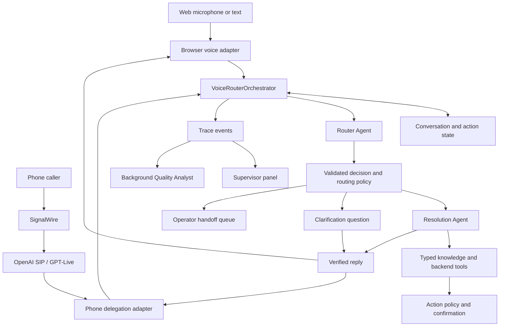

# Case 2: Voice Router implementation plan

Reviewed on 2026-09-23 against `TZ.md`, `MULTI-AGENT.md`, this repository, and `/home/beknur/hackathon/hack-tools`. This document is the implementation plan. The original architecture proposal remains in `MULTI-AGENT.md`; this plan takes precedence where they differ. Work below is planned unless explicitly described as existing or verified.

**Use SignalWire for telephony, one application-owned orchestrator, and OpenAI Agents SDK specialists backed by Responses. Keep the forty official scenarios as data.**

## 1. What we have

| Component | Current evidence | Reuse decision |
| --- | --- | --- |
| Browser voice backend | `v2v/` provides STT, TTS, Responses, Realtime configuration, WebSocket proxy and WebRTC credentials | Reuse and connect to the case-2 orchestrator. Generic conversation alone does not demonstrate scenario selection. |
| Router prototype | `app/router_service.py` has catalog loading, LLM decisions, alternatives, history and pending topics | Refactor this into the core; avoid two competing routers. |
| App integration | `app/main.py` mounts only `create_v2v_router()` | Mount session/routing/trace/handoff endpoints. `RouterService` and `RouterDatabase` are currently unused by the entry point. |
| Frontend | `frontend/app/page.tsx` renders the Velorah landing page; its CTA says live routing is not connected | Build the microphone/text simulator and supervisor panel. |
| Starter kit | Official scenarios, sample dialogues, knowledge/backend data, dev utterances and evaluator were not found in the inspected trees | Add a configurable import location; clearly label interim fixtures and preserve official IDs when data arrives. |
| Telephony | Call lifecycle, verified webhooks, SIP acceptance, Live sideband runner, delegation cancellation, limits and injected runtimes | Reusable foundation for a single-process demo, with integration gaps below. |
| SignalWire compatibility | `telephony/config.py` has carrier base URL, separate signing key and SIP URI overrides; `twilio.py` accepts SignalWire signatures | Reuse the compatibility adapter with SignalWire configuration; a full carrier rewrite is unnecessary. |
| Codex agent gateway | `codex-agent` runs Codex per turn behind a partial Responses interface | Optional development/offline assistant; unsuitable as the strict live-routing endpoint as currently implemented. |

The existing `hack-tools/PLAN.md` is the telephony roadmap. No root `PLAN.md` existed in this application at review time.

## 2. Readiness findings

1. **Action confirmation is not enforced.** `telephony/tools.py:56` declares `confirm`, but `ToolRegistry.invoke` at line 128 never checks it. Supplied arguments are also not validated against the advertised JSON Schema. Add runtime validation, confirmation tied to exact arguments, and idempotency before enabling mutations.
2. **The Codex gateway drops required request fields.** `gateway/request.py:31` uses `extra='ignore'`; `instructions`, `tools`, `text.format`, `background` and `previous_response_id` are not implemented. Its prompt builder retains user/assistant text and drops image content. Sending a strict routing schema to this endpoint would not enforce it. `model` identifies the gateway; `backing_model` selects its Codex model.
3. **Codex conversation IDs are not durable memory.** `gateway/codex_runtime.py` starts an ephemeral thread per turn; IDs prevent concurrent turns and callers resend history. Process startup adds an unmeasured latency cost. The package requires Python 3.14; this app's Docker image uses 3.12.
4. **Current routing uses JSON mode.** `app/router_service.py:182` requests `json_object` and validates afterward. Use strict Structured Outputs/SDK `output_type`, retain domain validation, and handle refusals, incomplete output and timeouts separately from uncertainty. [Structured Outputs](https://developers.openai.com/api/docs/guides/structured-outputs)
5. **Handoff is currently wording only.** `app/router_service.py:272` promises transfer without creating operator work. Add an in-app handoff queue and operator takeover, then connect phone transfer.
6. **Language and slot handling need work.** Fallback clarification/handoff text is Russian. Missing customer/policy parameters should trigger slot collection inside the selected scenario, rather than uncertainty about intent. Preserve Kazakh and mixed-language context.
7. **Realtime and GPT-Live are distinct protocols.** Browser code uses Realtime; telephony uses `client.live` and Live delegation events. Keep separate adapters, normalized application events and one acceptance owner per call. Their session payloads and event names are not interchangeable. [OpenAI voice/SIP](https://developers.openai.com/api/docs/guides/voice-sip)
8. **The telephony README trails the code.** It calls the sideband worker future work, but `runner.py` and `example_app.py` wire an in-process runner. Redis/SQL configuration fields do not mean distributed storage is implemented. Use one backend process for this profile.
9. **Carrier/session correlation needs testing.** `_bridged_outbound_call` explicitly links outbound records. A carrier-inbound call bridged into OpenAI can become two records. Preserve SignalWire call ID, OpenAI session ID and application conversation ID; address inbound correlation. Caller-controlled SIP headers cannot authorize linking by themselves.
10. **Numbers in the original proposal are examples.** No inspected result establishes 94.2% accuracy, 218 ms routing or 1.5 s response onset. Measure these before presenting them as results.

## 3. Main architecture



`VoiceRouterOrchestrator.process_turn(TurnInput) -> TurnResult` is the main entry point. It owns ordering, state commits, cancellation, tool permissions and the final reply. Browser, phone and evaluator share the same routing service. Telephony's incoming-call acceptance policy is separate from the forty-scenario LLM router.

Choose Agents SDK because FastAPI already owns deployment, state and business controls. Responses supplies model inference. The hosted Agents API is a separate managed runtime; the local Codex gateway is another implementation. Do not stack all three orchestration runtimes inside each voice turn. [OpenAI runtime comparison](https://developers.openai.com/api/docs/guides/agents)

| Role | Responsibility | Execution |
| --- | --- | --- |
| Router Agent | Select scenario, detect topic transition, extract candidate parameters, explain boundary choice, report alternatives | Once per committed customer turn; all forty scenarios initially available |
| Resolution Agent | Use scenario-scoped tools/facts; produce a short answer or missing-parameter question | After accepted routing; combines execution planning and response composition |
| Clarifier | Ask one question distinguishing plausible scenarios | Start with a router-produced question; make a separate agent only if evaluation justifies it |
| Deep Router | Reconsider ambiguous decisions with a stronger configured model | Conditional optimization after a measured baseline, with a bounded deadline |
| Quality Analyst Agent | Analyze traces, confusion pairs and regressions; propose catalog/prompt improvements | After calls or on supervisor request; never silently changes the live catalog |

The orchestrator, registry, state store, action executor and event bus are normal code. Two cooperating online agents and a background analyst give distinct responsibilities without four mandatory serial model calls. SDK specialists can be exposed as tools while application code validates transitions. [SDK tool orchestration](https://developers.openai.com/api/docs/guides/tools)

## 4. Contracts, state and control

| Contract | Required content |
| --- | --- |
| `TurnInput` | conversation/turn IDs, channel, transcript, source event ID, timestamps, expected state version |
| `RoutingDecision` | action (`route`, `clarify`, `handoff`), nullable primary scenario, confidence signal, short rationale, alternatives, language (`ru`, `kk`, `mixed`, `other`), transition (`continue`, `switch`, `resume`, `new`), secondary intents, extracted parameters, nullable clarification question |
| `ExecutionResult` | status (`answered`, `need_parameter`, `need_confirmation`, `completed`, `failed`, `handoff`), sourced facts, missing parameters, nullable action proposal, tool results |
| `TurnResult` | validated decision, reply, execution status, state version, trace ID, actual timings, optional audio reference |
| `TraceEvent` | event/conversation/turn/trace IDs, sequence, event type, stage duration, timestamp, payload, prompt/catalog/model versions |
| `OperatorHandoff` | ticket ID, reason, language, recent dialogue, active/suspended scenarios, slots, failed tool, pending confirmation and operator status |

Use closed strict schemas and explicit nullable fields. Represent extracted parameters as typed entries (`name`, `value`, `source_turn_id`) or catalog-specific schemas rather than an unrestricted `dict[str, Any]`. Validate catalog membership, parameter types, tool names and action consistency after parsing.

Store per conversation: recent ten-turn dialogue, active scenario, suspended scenario frames with their own slots/status, ordered secondary intents, language preference, clarification count, pending action, completed action IDs, processed input IDs and state version. Freeze the catalog version during an evaluation run.

Each turn:

1. Deduplicate input; establish turn/version; assemble only this conversation's context.
2. Call the router, validate its decision and apply uncertainty/topic policies.
3. Route, clarify, collect parameters or create handoff. Preserve secondary intents while emitting the single primary prediction expected by the official evaluator.
4. Run allowed read tools or prepare a mutation. Confirmation names the exact action/arguments; topic changes or argument edits invalidate it. An unrelated later “yes” cannot authorize it.
5. Commit state and trace for **all** outcomes, including clarification, handoff, cancellation and failure. The original proposal's early returns otherwise bypass its state update.
6. Deliver only the current reply. On interruption cancel work/speech where possible and discard stale outputs. Record already-committed side effects and never repeat them.

Serialize state commits and mutations per conversation. Concurrent read-only work may be canceled, but two delegations cannot independently mutate the same state. Retain exact policy/customer values rather than relying on model summaries. Update scenario-specific tool permissions after a topic change.

The supervisor receives a short evidence-based explanation and relevant scenario boundaries. Internal model reasoning is not the trace contract. Clarification thresholds are empirically tuned signals, not calibrated probabilities by default.

## 5. SignalWire plan

**SignalWire is the selected carrier.** Start with its Compatibility API and the existing adapter. Class names and callback paths containing `twilio` are implementation names; they do not require a Twilio account. SignalWire can dial external SIP endpoints and uses a project signing key for Compatibility webhook verification. [SIP dialing](https://signalwire.com/docs/compatibility-api/cxml/reference/voice/sip), [webhook verification](https://signalwire.com/docs/compatibility-api/guides/webhook-security)

Existing package configuration, with placeholders only:

```dotenv
TELEPHONY_TWILIO_ACCOUNT_SID=<SignalWire project ID>
TELEPHONY_TWILIO_AUTH_TOKEN=<SignalWire API token>
TELEPHONY_TWILIO_SIGNING_KEY=<SignalWire webhook signing key>
TELEPHONY_TWILIO_FROM_NUMBER=<SignalWire phone number>
TELEPHONY_TWILIO_API_BASE_URL=https://<space>.signalwire.com/api/laml
TELEPHONY_OPENAI_PROJECT_ID=<OpenAI project ID>
TELEPHONY_OPENAI_SIP_DIAL_URI=sip:<OpenAI project ID>@sip.api.openai.com;transport=tls
TELEPHONY_OPENAI_API_KEY=<OpenAI API key>
TELEPHONY_OPENAI_WEBHOOK_SECRET=<OpenAI webhook signing secret>
TELEPHONY_PUBLIC_BASE_URL=https://<public backend hostname>
TELEPHONY_AGENT_RUNTIME=callable
```

Verify the generated REST URL against SignalWire's Compatibility endpoint: a base-URL override and mocked signature test do not establish live SDK compatibility. Override the adapter's `sips:` default as shown. Verify TLS signaling and negotiated SRTP media with the actual account/trunk. SignalWire exposes SIP gateway encryption settings. [SignalWire SIP platform](https://signalwire.com/docs/platform/voice/sip)

Integration steps:

1. Configure the number's Compatibility voice callback to `/telephony/webhooks/twilio/voice`. Preserve the exact public URL for signature verification. Keep Compatibility form/cXML callbacks separate from SWML/JSON callbacks.
2. Return cXML dialing OpenAI SIP. Audio flows between SignalWire and OpenAI; FastAPI handles call control and backend decisions.
3. Verify `live.transport.incoming`, accept once through the existing Live controller, and attach `LiveSessionRunner`. Preserve existing legacy Live-event handling as needed; only one handler owns acceptance.
4. Implement `VoiceRouterAgentRuntime` against the existing `AgentRuntime` protocol. It calls the shared orchestrator, emits approved speech as `CommentaryUpdate`, and finishes with `TaskCompleted`. Store trace/state in the application.
5. Add a transcript assembler and explicit turn IDs. Live transcript deltas and delegations are not one-to-one user turns. Correlate media offsets/session/version to avoid duplicate routing. Ensure business answers have a validated backend route; instructions alone are not proof of this invariant.
6. Test inbound correlation, duplicate callbacks, failed acceptance, interruption, hangup, final usage and operator transfer. A SIP REFER acknowledgement means the request was relayed, not that an operator answered.

A direct SignalWire SIP gateway into OpenAI is an alternative inbound configuration if carrier callbacks are unnecessary. Choose one ingress path for the demo. OpenAI inbound SIP does not originate outbound PSTN calls; SignalWire owns that leg. Realtime SIP would need a separate controller/event adapter because the reused phone package implements GPT-Live. [OpenAI SIP](https://developers.openai.com/api/docs/guides/voice-sip), [Live delegation](https://developers.openai.com/api/docs/guides/live-delegation)

## 6. Browser voice, tracing and latency

First deliver microphone → STT → shared router → resolution → TTS, plus text fallback. Then integrate Realtime for streaming speech and interruption through the same contracts. The existing WebSocket proxy is a starting point; minting WebRTC credentials alone does not run backend tools or enforce routing.

For controlled Realtime routing, the backend owns response creation: disable automatic answers while waiting for final transcription/routing, correlate input item IDs, and then produce the approved reply. Alternatively expose one backend turn tool and verify invocation coverage; do not assume the voice model calls it on every utterance. Keep upload/STT/TTS as a functional fallback with honest timing labels.

Publish supervisor events as soon as routing completes. Show transcript, active scenario, reason, alternatives, uncertainty, language, pending topics, handoff status and per-stage timings. SDK tracing complements this application event contract; it does not replace the required panel.

Measure:

- `routing_ms`: transcript/context ready → final validated decision, including deep-router work. Show model calls as subspans.
- STT, queue/context, tools, response generation and TTS independently. Use `null` for unavailable measurements rather than invented zero values.
- `speech_end_to_first_audio_ms`: speech end → actual playback onset on the same browser clock. First server audio byte and complete TTS duration are different measurements. Label phone timing estimates explicitly.
- p50/p90/p95, counts and errors by language, cold/warm requests, catalog and model version. Never subtract unsynchronized browser/server clocks.

`TZ.md` targets **500 ms routing and 1.5 s response onset**. These earn speed credit; the specification does not make them submission gates. Generic filler speech must not hide delayed substantive answers.

Keep rules, schema and catalog as a stable prompt prefix, with conversation state/utterance afterward. Measure cached-token usage. Explicit prewarming depends on the model/API configuration; enable it only when supported. [Prompt caching](https://developers.openai.com/api/docs/guides/prompt-caching)

## 7. Role of every requested OpenAI capability

Every listed capability has a role. Complete the core demo first, then the extended workflows. A capability is implemented only after a real invocation produces a trace/result.

| Capability | Concrete role | Stage |
| --- | --- | --- |
| Responses API | Router and grounded resolution inference | Core |
| Agents SDK | Typed specialists, bounded runs, function tools, tracing in FastAPI | Core |
| Agents API | Evaluate a managed post-call audit/research session if available to the project; compare against SDK-owned analyst jobs before choosing the worker runtime | Extended runtime evaluation |
| Multi-agent orchestration | Router + Resolution; conditional Deep Router; background Quality Analyst | Core + quality |
| Function calling | Query synthetic customer/policy/payment facts; propose and execute confirmed mock actions | Core |
| MCP | Expose read-only synthetic knowledge/customer tools to the analyst through MCP, reusing the same underlying implementations | Extended knowledge |
| Web search | Supervisor-requested public research with citations, separated from fictional company facts | Extended research |
| File search | Retrieve uploaded policy/FAQ documents from a versioned vector store with source references | Extended knowledge |
| Computer use | Operate an isolated mock insurer portal for a workflow without an API; execute and verify UI actions in our browser environment | Extended legacy demo |
| Code Interpreter | Analyze exported synthetic evaluations/traces and produce confusion/latency charts | Quality |
| Image/vision | Extract candidate fields from a synthetic policy/receipt image; confirm corrections before using them | Extended multimodal |
| Realtime | Streaming browser audio, turn detection and interruption, with explicit backend routing | Voice optimization |
| SIP | SignalWire audio into OpenAI with verified webhook/sideband control | Phone |
| Structured Outputs | Routing decisions, action proposals and analyst results | Core |
| Background mode | Asynchronous Responses report jobs with IDs, polling/completion, cancellation and separate errors | Quality |
| Sessions/state | Application conversation state, mapped separately to SDK/Responses, voice and carrier resource IDs | Core |
| Tracing/observability | SDK spans plus supervisor events and actual stage measurements | Core |
| Prompt caching | Stable rules/catalog/schema prefix and measured cache hits | Optimization |

These interfaces are not automatically available from any endpoint named `/responses`. Hosted tools require explicit configuration and compatible models/runtimes. [Tools overview](https://developers.openai.com/api/docs/guides/tools)

Background mode supports asynchronously observed work; use it for reports, outside the immediate spoken-answer path. [Background mode](https://developers.openai.com/api/docs/guides/background)

The analyst's computation, vision and UI workflows need appropriate inputs and execution environments. The current Codex gateway does not implement them by accepting extra JSON fields. [Code Interpreter](https://developers.openai.com/api/docs/guides/tools-code-interpreter), [vision](https://developers.openai.com/api/docs/guides/images-vision), [computer use](https://developers.openai.com/api/docs/guides/tools-computer-use)

## 8. Implementation order and acceptance gates

| Stage | Work | Done when |
| --- | --- | --- |
| 0. Contracts/data/package | DTOs, state, tool policy; pinned dependencies; versioned/vendored hack-tools modules; starter-kit import | Clean checkout has no local `/home/beknur/...` dependency; catalog validates; absent official data is explicit |
| 1. Complete web slice | Mount router; strict outputs; microphone/text input; voice reply; supervisor panel; initial evaluator | Real RU/KK/mixed input changes the visible scenario through the LLM; required trace fields appear; one-command launch works |
| 2. Context/actions | Suspend/resume, intent queue, slot collection, confirmation, typed mock tools, operator queue | Ten-turn tests preserve slots; stale work cannot overwrite new turns; no unconfirmed/duplicate mutation; operator can take over |
| 3. SignalWire | Compatibility setup, Live runtime adapter, correlation, transcript assembly, actual call smoke test | Phone uses the same decision service and trace panel; interruption, hangup and transfer outcomes are visible |
| 4. Evaluation/speed | Official evaluator, boundary/language/topic tests; warm/cold timings; caching, conditional deep routing and Realtime trials | Versioned reports compare baselines; unnecessary clarifications cannot mask errors; first-audio timing is actual |
| 5. Extended capabilities | Analyst jobs, MCP/file search, research, synthetic image input, mock legacy portal and hosted Agents API evaluation | Each enabled capability produces a trace/artifact; its failure cannot disrupt the live demo |
| 6. Submission | Fresh Docker launch; README with models/keys/data, operator flow, SignalWire setup and limits | Another person can reproduce the browser demo and routing evaluation; phone prerequisites are explicit |

Begin SignalWire account/trunk readiness alongside the web slice. Build trace instrumentation and evaluation fixtures with stage 1; stage 4 is optimization rather than the first test of routing.

Keep `ROUTER_MODEL`, `RESOLUTION_MODEL`, optional `DEEP_ROUTER_MODEL`, browser voice model and phone Live model configurable. The current router model is one baseline candidate. Verify account availability and schema/reasoning settings. Model names and thresholds in the original proposal are candidates, not measured winners.

Suggested layout:

```text
app/
  main.py                  # lifespan, dependencies, endpoint registration
  api/                     # sessions, turns, events, handoffs, catalog
multi_agent/
  orchestrator.py
  contracts.py
  state.py
  catalog.py
  agents/                  # router, resolution, optional deep router, analyst
  policies/                # routing, action confirmation, handoff
  tools/                   # knowledge and synthetic backend
  adapters/                # browser, phone AgentRuntime, SignalWire config
  telemetry/               # events and stage timing
  evals/                   # official evaluator adapter and dialogue replay
v2v/                       # reused voice components
telephony/                 # versioned/vendored phone package
frontend/                  # simulator and supervisor views
data/                     # starter kit or documented mount
tests/                    # domain, action policy, adapter integration
```

Update Hatch package inclusion and Docker COPY instructions when adding packages. If retaining SQLite, create a writable database volume for the non-root backend user. Add a same-origin API proxy or explicit CORS; current frontend Caddy configuration only serves static files.

Proposed API: `POST /api/sessions`, `POST /api/sessions/{id}/turns` (text), `POST /api/sessions/{id}/audio-turns`, `GET /api/sessions/{id}/events` (SSE), `POST /api/sessions/{id}/confirmations`, and operator handoff endpoints. These are planned contracts, not existing routes.

If later divided among developers/coding agents, use bounded owners: core routing/state; browser simulator/voice; SignalWire/call lifecycle; evaluation/telemetry. Agree contracts first, give shared contracts and `main.py` one integration owner, and integrate through the complete demo gate. Runtime multi-agent architecture does not require parallel coding agents.

## 9. Verification and remaining limits

- Telephony's existing offline suite: **89 passed**, with fake providers/SDK clients. It includes a SignalWire-compatible signature check, not a real carrier call.
- This application's test checks service/voice route registration only. Attempts using existing environments stopped during collection: the telephony environment lacked `openai`; the general hack-tools environment lacked `python-multipart`. This is an environment limitation, not evidence of a failed application assertion. No dependencies were installed during this planning review.
- Codex gateway source/tests were inspected. Its suite was not run: no installed Python 3.14 or `openai_codex` environment was found.
- No paid model requests, real calls, carrier changes or external messages were made. Model availability, carrier interoperability, bilingual speech and latency need live validation.
- Official routing evaluation could not run because the starter kit/evaluator were absent. Track accuracy separately from clarification coverage, false handoffs, topic-resume correctness and tool outcomes. Preserve official scoring; label generated challenge cases separately.

Required regressions: identical final utterance with different prior context; RU/KK/mixed speech; neighboring-scenario ambiguity; resumed topic; multiple intents; missing slots; unsupported request; malformed/refused model output; tool timeout; duplicate confirmation; interrupted generation; duplicate webhook; isolated concurrent conversations.
