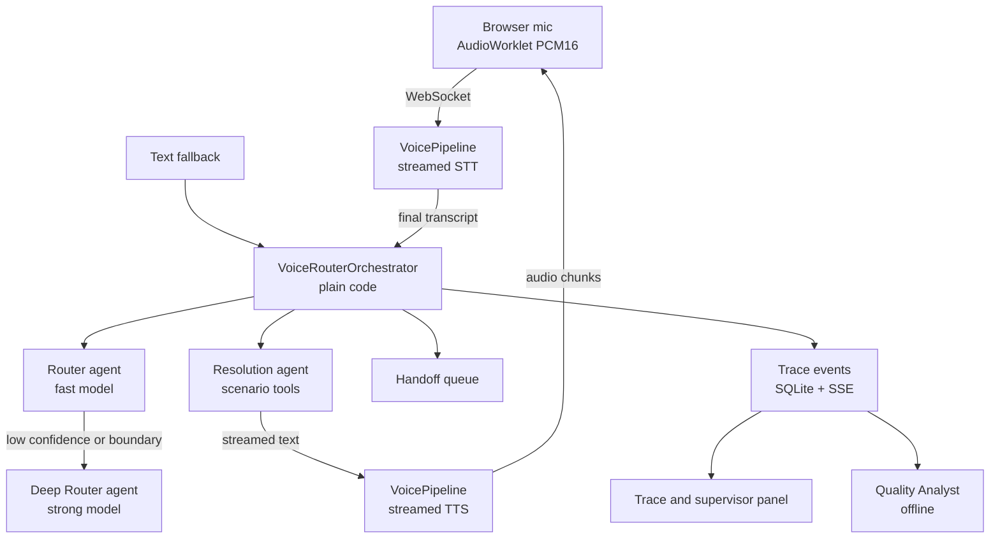

# Voice Router: implementation plan (Case 2)

As of 2026-09-23. Supersedes the earlier plan where they differ.

**Build a web-first voice bot. A code orchestrator in FastAPI calls four OpenAI Agents SDK agents: a fast Router, a Deep Router for hard cases, a Resolution agent, and an offline Quality Analyst. Speech runs through the SDK's `VoicePipeline`, not a speech-to-speech model, so every answer goes through our router, our trace, and our confirmation rules. The phone line (SignalWire) is a stretch goal. README and one-command launch work from day 0.**

## 1. What the case scores

| Criterion | Points | What it means for us |
|---|---|---|
| Functionality | 25 | Microphone to routed voice answer; accuracy on the jury's 10 utterances |
| Technical implementation | 25 | Real LLM decision layer; the build matches what the README claims |
| README and reproducibility | 25 | One command, a clean clone, a demo script another person can follow |
| Value and applicability | 15 | Handoff, context, confirmation, honest limits |
| Potential and originality | 10 | Fast/deep hybrid, supervisor analytics, catalog editing |

Latency is a bonus: 500 ms to choose the scenario, 1.5 s from end of speech to start of reply. It "does not lower the main score".

**Must-haves:**
- The jury speaks into the microphone and the bot answers by voice. Text is a fallback only.
- An LLM chooses the scenario. An encoder or intent classifier does not count.
- Accuracy on 10 jury utterances: 2 in Kazakh, 1 mixing languages within a phrase, and some with topic changes or at scenario boundaries.
- A trace after every utterance: scenario, rationale, alternatives, and timing per stage.

**Hard rules:**
- Not allowed:
  - an intent classifier;
  - hardcoded test utterances;
  - real call recordings.
- Required:
  - hand off to an operator when the bot cannot cope;
  - no irreversible action without the customer's confirmation;
  - show uncertainty;
  - launch with one command.

**Optional items we target:**
- Fast path plus LLM, with a measured latency gain.
- Keep context and return to an interrupted topic.
- Ask for clarification instead of guessing.
- Hand off with context.
- Extract parameters from speech.
- Streaming.
- Detect emotion and adjust tone.
- Error statistics for the supervisor.
- Edit the catalog without developers.

## 2. Changes from the previous plan

| Previous plan | Now | Why |
|---|---|---|
| SignalWire phone path as stage 3 | Stretch goal, after submission-ready | The jury uses a browser microphone; the phone adds the most integration risk for no must-have |
| Section 7: every OpenAI capability (computer use, Code Interpreter, vision, MCP, file/web search, background mode, Agents API) | Cut | The case asks for none of them; half-built extras cost Technical points |
| Deep Router as a later optimisation | Fast Router plus Deep Router from phase 3, with measured gain | This *is* the case's optional hybrid |
| README and Docker in stage 6 | Day 0, kept working | Worth 25 points |
| STT treated as solved | Kazakh speech-recognition test on day 1 | A wrong transcript makes routing wrong; Kazakh support is not documented |
| Codex gateway as an optional assistant | Out of the submission; team dev tool only | Seconds of latency, ignores schemas, Python 3.14 |

**Kept unchanged:** the orchestrator, the contracts, per-conversation state, confirmation bound to exact arguments, the handoff queue, trace events, and honest measurement (`null` instead of invented numbers).

## 3. Architecture



The orchestrator is ordinary code. It owns turn order, state commits, confirmation, handoff and the trace. It calls each agent with `Runner.run`, the "orchestrating via code" pattern, and never gives control of the turn to a model.

## 4. Agents

| Agent | Runs | Model (env var) | Tools | Output |
|---|---|---|---|---|
| **Router** | Every utterance | `ROUTER_MODEL=gpt-6-luna`, lowest reasoning effort | None | `RoutingDecision` |
| **Deep Router** | Only when Router confidence is low or its top two are neighbouring scenarios | `DEEP_ROUTER_MODEL=gpt-6-sol` | None | `RoutingDecision` |
| **Resolution** | After a route is accepted | `RESOLUTION_MODEL=gpt-6-luna`, streamed | Only the chosen scenario's read tools, plus `propose_action` | Reply text, missing parameter, or action proposal |
| **Quality Analyst** | After a session or on supervisor request | `ANALYST_MODEL=gpt-6-sol` | Read-only trace queries | `QualityReport`: confusion pairs, suggested catalog edits |

Clarification and handoff are **not** separate agents. The clarifying question comes from the Router's output, and code builds the handoff ticket from state. A normal turn therefore costs one Router call plus one streamed Resolution call. The Deep Router adds a call only on hard cases.

**Codex agent:** not in the product. Use it as the team's own assistant, for example: "read `evals/out/*.json` and the traces, and tell me why these three utterances routed wrong".

## 5. Exact technologies

### Backend (Python 3.12)

| Package | Version | Used for |
|---|---|---|
| `openai-agents` | 0.22.x (0.22.3 verified) | Agents, runner, structured output, tools, tracing, voice pipeline |
| `openai-agents[voice]` | same | Installs the voice pipeline's extras. Check the extra's name on install |
| `openai` | 3.x (3.19.0 resolved) | Client used by the SDK; direct STT/TTS calls for the upload fallback |
| `fastapi`, `uvicorn[standard]` | current | HTTP, WebSocket, lifespan |
| `pydantic` v2 | current | Contracts; the SDK builds strict JSON schemas from them |
| `sse-starlette` | current | Trace event stream to the panel |
| `sqlite3` (stdlib) | — | State, traces, handoff tickets, catalog versions |
| `pytest`, `pytest-asyncio`, `ruff`, `mypy` | current | Tests, lint, types |

Reuse from `hack-tools`: `v2v/` (STT, TTS and the WebSocket proxy) and later `telephony/` for the stretch goal. Vendor both into the app repo, pinned, so a clean clone doesn't depend on `/home/...` paths.

### Agents SDK features we use

| Feature | Where |
|---|---|
| `Agent(output_type=RoutingDecision)` | Router and Deep Router: strict Structured Outputs, parsed into Pydantic |
| `Runner.run` / `Runner.run_streamed` | Orchestrator calls each agent directly; Resolution streams |
| `@function_tool` | Resolution's tools over `knowledge_base.json` and `mock_backend.json` |
| `RunContextWrapper[TurnContext]` | Passes conversation state and the allowed tool set into tools without the model seeing them |
| `ModelSettings(reasoning=Reasoning(effort=...), prompt_cache_retention="24h")` | Low effort on the Router; cache the catalog prefix |
| `agents.voice.VoicePipeline` + a custom `VoiceWorkflowBase` | `run(transcription)` calls the orchestrator and yields Resolution text, which the pipeline streams to TTS |
| `StreamedAudioInput` + `STTModelSettings(languages=["ru", "kk"], keywords=[...], turn_detection=...)` | Streamed recognition with end-of-turn detection; keywords from catalog terms |
| `trace()` / `custom_span()` | One trace per turn; our stage spans appear on the OpenAI traces dashboard |
| `set_default_openai_responses_transport("websocket")` | Try it and measure against HTTP; keep whichever is faster |

**Not used, on purpose:**
- **Handoffs:** they give the turn to a model.
- **SDK `Session`s:** the orchestrator owns state.
- **`RealtimeAgent`:** speech-to-speech would bypass the router's authority.
- **Hosted tools.**
- **Codex.**

### Speech models

| Role | Model | Notes |
|---|---|---|
| Streamed STT | `gpt-live-transcribe` | Through `VoicePipeline` streamed input |
| Fallback STT (upload) | `gpt-transcribe`, `languages: ["ru", "kk"]` | Text-plus-upload fallback path |
| TTS | `gpt-4o-mini-tts`, streamed | Pass tone instructions from `sentiment` |

Kazakh support is not stated in OpenAI's STT docs. On day 1, record about 20 Kazakh and mixed phrases and compare `gpt-live-transcribe`, `gpt-transcribe` and `gpt-realtime-whisper`, then check TTS Kazakh by ear. Candidate fallbacks if these fail are Yandex SpeechKit (`kk-KZ`) or ISSAI Kazakh models; neither is verified for this use yet. The trace always shows the raw transcript.

### Frontend

- **App:** the existing Next.js app.
- **Mic:** an `AudioWorklet` captures 24 kHz mono PCM16 and sends it over a WebSocket to `/ws/voice/{session}`.
- **Playback:** TTS chunks through the Web Audio API, with barge-in. Speech from the customer stops playback and cancels the turn.
- **Panel:** `EventSource` on `/api/sessions/{id}/events`, for the trace and supervisor panels.
- **Hosting:** Caddy serves the build and proxies `/api` and `/ws` to the backend (same origin, no CORS).

### Infrastructure

- **Launch:** `docker compose up` starts the backend and frontend. A `data/` volume holds the starter kit and SQLite.
- **Config:** `.env.example` holds only `OPENAI_API_KEY` and the model env vars above.
- **Commands:** `make eval` (or `just eval`) runs the evaluator; `make test` runs the tests.

## 6. Contracts

```python
class Language(StrEnum): ru = "ru"; kk = "kk"; mixed = "mixed"; other = "other"
class Transition(StrEnum): new = "new"; continue_ = "continue"; switch = "switch"; resume = "resume"
class Action(StrEnum): route = "route"; clarify = "clarify"; handoff = "handoff"

class Param(BaseModel):
    name: str
    value: str
    source_turn_id: str

class Alternative(BaseModel):
    scenario_id: str
    why_not: str

class RoutingDecision(BaseModel):
    action: Action
    scenario_id: str | None          # validated against the catalog after parsing
    confidence: Literal["high", "medium", "low"]
    rationale: str                   # short, evidence-based: shown to the supervisor
    alternatives: list[Alternative]  # up to 3
    language: Language
    transition: Transition
    secondary_intents: list[str]     # scenario ids queued for later
    params: list[Param]
    clarification_question: str | None
    sentiment: Literal["calm", "frustrated", "angry", "anxious"]
```

Also in `contracts.py`, as described in the previous plan:
- `TurnInput`, `TurnResult`, `ExecutionResult`;
- `ActionProposal` (action name, exact arguments, hash);
- `TraceEvent`;
- `OperatorHandoff`.

After parsing, validate:
- the scenario exists;
- parameter names belong to that scenario;
- `action` agrees with the other fields (for example, `clarify` must carry a question).

A validation failure is a stage error in the trace, never a silent guess.

## 7. One turn

1. **Deduplicate and record:** drop repeated input, assign turn id and state version.
2. **Assemble context:** catalog (stable prefix) + last 10 turns + active and suspended scenarios + slots + the utterance.
3. **Route:** the fast Router runs. If confidence is `low` or the top pair are neighbours in the catalog, the Deep Router runs with a deadline, and the trace shows both decisions.
4. **Apply policy in code:**
   - `clarify` → ask the question, at most 2 times per topic, then hand off.
   - `handoff` → create a ticket carrying the full context.
   - `route` → switch, suspend or resume scenario frames per `transition`, and queue secondary intents.
5. **Resolve:** Resolution gets only that scenario's tools and streams a short reply. A mutation comes back as an `ActionProposal`; the bot reads the exact action back and waits.
6. **Confirm:** a "yes" counts only for the pending proposal with unchanged arguments in the same topic. It runs once, keyed by the proposal hash.
7. **Commit:** every outcome commits state and trace events, including clarify, handoff, cancel and failure. Barge-in cancels generation and speech, and discards stale output.

Commits and mutations are serialised per conversation with an `asyncio.Lock` held per conversation id.

## 8. Latency

| Stage | Budget (target, unmeasured) | How |
|---|---|---|
| STT final after end of speech | ~300 ms | Streamed recognition; server voice-activity detection |
| Routing | ≤ 500 ms | Fast model, low reasoning effort, cached catalog prefix, warm connection |
| Resolution first sentence | ~400 ms | Streamed; TTS starts at the first sentence |
| TTS first audio | ~300 ms | Streamed `gpt-4o-mini-tts` |

**If the budget slips:**
- Speculative Resolution: start it on the fast route while the Deep Router checks, and drop it if the route changes.
- For purely informational scenarios, build the reply from the catalog's sample answer and the backend facts, with no second model call.

**How we measure:**
- `routing_ms`: from transcript ready to validated decision, with model calls as sub-spans.
- `speech_end_to_first_audio_ms`: both ends measured on the browser clock.
- Report p50, p90 and p95 by language and warm/cold, plus cached-token counts.
- Anything not measured is shown as `null`.

## 9. Trace and supervisor panels

**Per turn:**
- Raw transcript.
- Chosen scenario, rationale and alternatives, with why each was rejected.
- Confidence, language and transition.
- Which router answered: fast or deep.
- Extracted parameters.
- Suspended topics and the intent queue.
- Pending confirmation and handoff status.
- Timing for each stage.

**Supervisor view:**
- Error statistics: low-confidence rate, clarification rate, handoffs, Deep Router rate, confusion pairs from the Quality Analyst.
- The handoff queue, where an operator can take over with the full context.
- Catalog editor: edits create a new catalog version and the router reloads. An evaluation run pins one version.

## 10. Evaluation

- **`make eval`** runs the starter kit's `evaluate.py` over `dev_utterances.json` through the **full orchestrator**, not a bare prompt. It also replays `dialogs_sample.json` turn by turn.
- **Report:**
  - accuracy, broken out by simple, topic change, mixed-language and boundary;
  - the Kazakh subset;
  - clarification rate;
  - false handoffs;
  - topic-resume correctness;
  - latency percentiles.

  Results go to `evals/out/<date>-<catalog-version>-<models>.json`, so model choices are compared on data.
- **Our own challenge cases** live in a separate file and are labelled as ours. Never tune prompts on individual test phrases, since that reads as hardcoding.
- **Regression tests:**
  - Routing:
    - the same final utterance with different context;
    - neighbouring scenarios;
    - resuming a topic;
    - multiple intents;
    - a missing slot;
    - an unsupported request.
  - Failures:
    - malformed or refused model output;
    - a tool timeout.
  - Concurrency and safety:
    - a duplicate confirmation;
    - barge-in;
    - isolated concurrent conversations.

## 11. Repository layout

```text
app/
  main.py              # lifespan, routes, dependencies
  api/                 # sessions, turns, voice websocket, events (SSE), handoffs, catalog
multi_agent/
  contracts.py
  orchestrator.py      # VoiceRouterOrchestrator.process_turn
  state.py             # per-conversation state, sqlite
  catalog.py           # load + validate scenarios.json, versions
  agents/              # router.py, deep_router.py, resolution.py, analyst.py
  policies/            # routing thresholds, confirmation, handoff
  tools/               # knowledge_base + mock_backend function tools
  voice/               # VoicePipeline workflow adapter
  telemetry/           # TraceEvent, stage timers
evals/                 # runner around evaluate.py, dialogue replay, challenge set
vendor/                # pinned v2v (+ telephony for the stretch)
frontend/              # simulator, trace panel, supervisor view
data/                  # starter kit (mounted), sqlite
tests/
docker-compose.yml  Makefile  .env.example  README.md
```

## 12. Build order

Each phase ends submittable.

| Phase | Work | Done when |
|---|---|---|
| **0. Skeleton** | Compose, README skeleton, `contracts.py`, catalog loader, eval runner, placeholder catalog with the starter kit's shape | `docker compose up` works on a clean clone; `make eval` prints a number |
| **1. Core slice** | Router agent; text turn endpoint; Resolution with tools; voice pipeline mic to speaker; trace panel; Kazakh speech-recognition test | The jury flow works end to end in RU and KK; dev accuracy recorded; real stage timings shown |
| **2. Conversation** | 10-turn state; suspend and resume; intent queue; slots; clarify; confirmation; handoff queue and operator takeover | Multi-turn tests pass; no unconfirmed or duplicate action; handoff carries context |
| **3. Scoring extras** | Deep Router with measured gain; streaming tuned; sentiment and tone; error statistics; catalog editor; Quality Analyst | Hybrid gain reported with numbers; supervisor view complete |
| **4. Submission** | README final: architecture, models, keys, launch, demo script, measured results, limits; fresh-clone rehearsal | Someone outside the team launches it and completes the demo from the README alone |
| **Stretch** | SignalWire through `telephony/`, calling the same orchestrator | Only after phase 4 |

On hackathon day, load the starter kit into `data/` first, run the phase-0 validation, and swap out the placeholder catalog. Keep the official scenario ids unchanged.

## 13. Team split

| Owner | Area |
|---|---|
| A | Orchestrator, contracts, state, policies (and sole owner of `main.py` and `contracts.py`) |
| B | Agents and prompts, eval runner, model choices, Quality Analyst |
| C | Voice: `VoicePipeline` adapter, WebSocket, AudioWorklet, barge-in, the Kazakh speech test |
| D | Frontend: simulator, trace panel, supervisor view; README and Docker |

Agree `contracts.py` first. Everything integrates through the phase-1 end-to-end demo.

## 14. Risks and open questions

| Risk | Fallback |
|---|---|
| Kazakh STT or TTS quality | Day-1 comparison; switch vendor behind the voice adapter |
| Router misses 500 ms | Report honestly; speculative Resolution; the budget is a bonus, not a gate |
| `gpt-6-luna` weak on boundaries | The Deep Router covers them; the eval decides the model mix |
| Starter kit format differs from the placeholder | The catalog loader is the only code that reads it |
| Jury utterances are single phrases with no context | The router works with empty history; test both cases |

Open questions:
- How long is the hackathon? That decides whether phase 3 fits.
- Does the `openai-agents` voice extra install cleanly on Python 3.12 with the pinned `openai` version? Check in phase 0.

## Sources

- Case: HackAlem AI, Halyk Bank track, Case 2 "Voice Router" (the technical specification, English section).
- [OpenAI models](https://developers.openai.com/api/docs/models): `gpt-6-*`, `gpt-live-transcribe`, `gpt-transcribe`, `gpt-4o-mini-tts`, `gpt-realtime-whisper`.
- [OpenAI speech-to-text](https://developers.openai.com/api/docs/guides/speech-to-text): `languages` parameter; languages supported are not listed.
- [Agents SDK multi-agent orchestration](https://openai.github.io/openai-agents-python/multi_agent/): code-driven orchestration and agents as tools.
- `openai-agents` 0.22.3 source: `agents/voice/pipeline.py`, `voice/workflow.py`, `voice/model.py` (`STTModelSettings`), `model_settings.py` (`prompt_cache_retention`), `_config.py` (Responses WebSocket transport).
